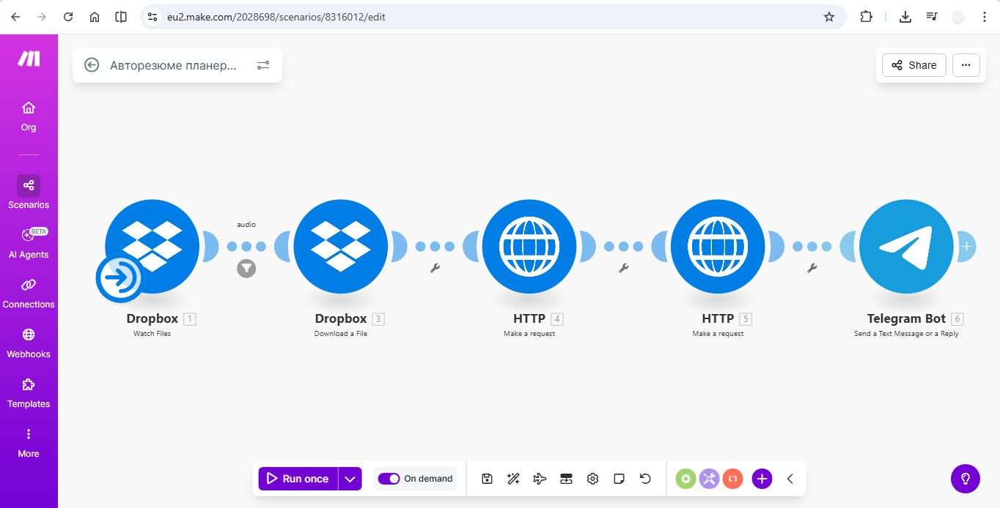
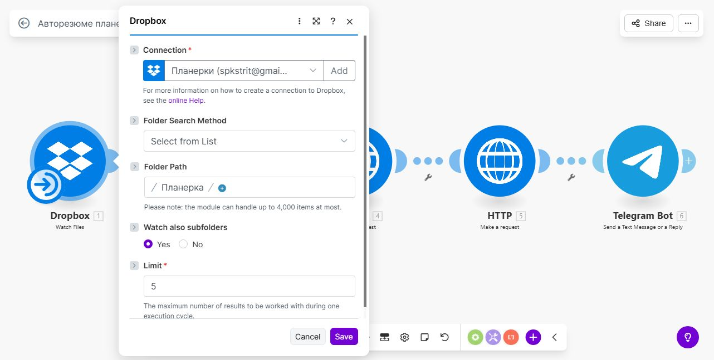
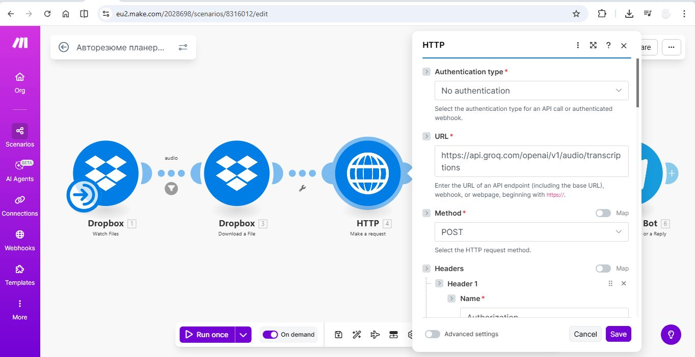
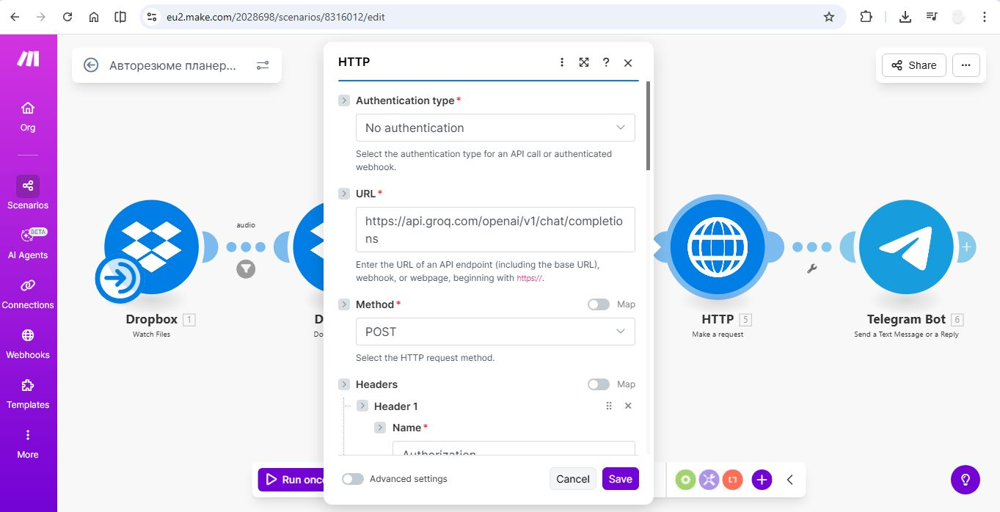
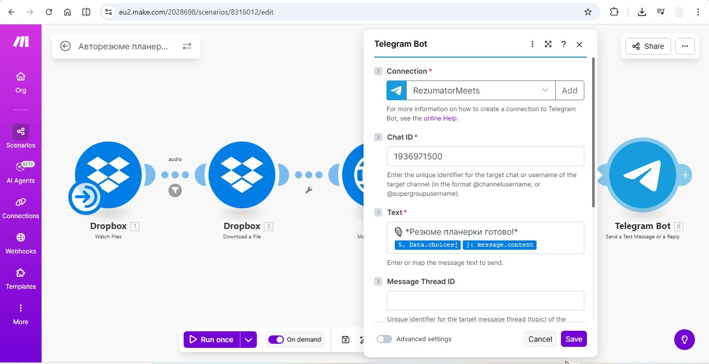
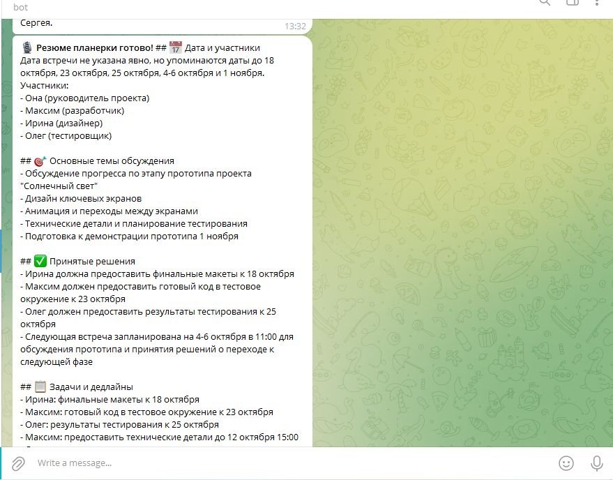

# Авторезюме планёрок — No-code автоматизация в Make.com

Полностью автоматическая система для создания текстовых резюме встреч: аудиозапись → транскрипция → суммаризация AI → готовое резюме в Telegram.

## Как работает
- Триггер: Новый аудиофайл в Dropbox.
- Скачивание файла.
- HTTP-запросы: транскрипция (Whisper/OpenAI) + суммаризация (GPT).
- Отправка резюме в Telegram-чат.

## Возможности расширения
- Прямая интеграция с Zoom, Яндекс Телемост, Google Meet (через Zapier/Albato или триггеры Make).
- Добавление уведомлений в Slack/Email, сохранение в Google Drive.
- Адаптация под ваши инструменты.

## Как использовать
1. Импортируйте blueprint.json в Make.com (File → Import blueprint).
2. Настройте API-ключи (OpenAI или аналог) и токен Telegram-бота.
3. Подключите Dropbox и Telegram.

## Скриншоты

## Файлы
- blueprint.json: Экспорт сценария для импорта в Make.com.

## Технологии
Make.com, Dropbox, HTTP-модули, Telegram Bot API.

Готов адаптировать под ваши задачи — пишите @MaslDmitriy!

Лицензия: MIT (свободное использование с атрибуцией).
